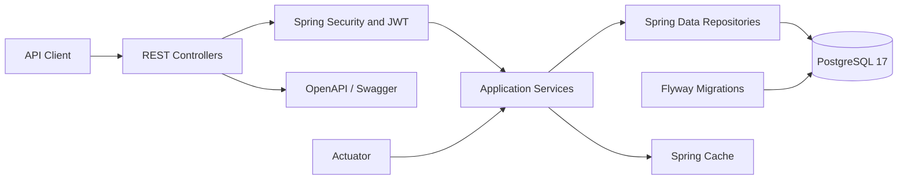
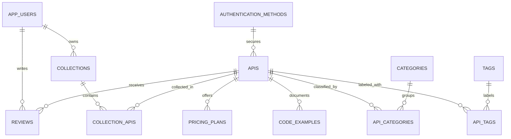

# FindApi

> A backend platform for discovering, comparing, and integrating APIs.

[](https://www.oracle.com/java/)
[](https://spring.io/projects/spring-boot)
[](https://www.postgresql.org/)
[](https://github.com/pedrolucasduarte/findapi-api/actions/workflows/ci.yml)
[](#license)

FindApi helps developers evaluate APIs by category, pricing model, authentication
method, SDK support, integration difficulty, availability, and other technical
criteria. The project is built as a production-minded modular monolith with
versioned REST endpoints, database-owned migrations, role-based authorization,
and integration tests backed by a real PostgreSQL instance.

## Overview

API discovery is often fragmented across search engines, provider websites, and
outdated lists. FindApi centralizes the technical and commercial information
needed to shortlist an API before starting an integration.

The current backend provides catalog management, advanced filtering, reviews,
collections, relationship management, aggregate dashboards, and public
rankings. It also establishes the database model for language-specific code
examples, which is planned for a future REST API.

## Features

- [x] API catalog with pagination, filtering, slugs, and soft deletion
- [x] Categories and tags
- [x] Authentication method catalog
- [x] Pricing plans associated with APIs
- [x] Reviews with rating averages and star distribution
- [x] User collections and collection/API relationships
- [x] API/category and API/tag relationship management
- [x] Advanced API search
- [x] Dashboard aggregates
- [x] Top-rated, free, open-source, Brazilian, and newest rankings
- [x] OAuth 2.0 Resource Server with JWT validation
- [x] Role-based and ownership-aware authorization
- [x] OpenAPI 3 and Swagger UI
- [x] Structured audit logs for relationship and profile mutations
- [x] Spring Cache for dashboard and ranking queries
- [x] Actuator health, info, and metrics
- [x] PostgreSQL full-text search foundation with `tsvector` and GIN indexes
- [x] Flyway-managed schema and seed data
- [x] Testcontainers integration tests with PostgreSQL 17
- [ ] REST endpoints for code examples
- [ ] Frontend application

## Technology Stack

| Area | Technologies |
|---|---|
| Language | Java 25 |
| Framework | Spring Boot 4, Spring MVC |
| Security | Spring Security, OAuth 2.0 Resource Server, JWT |
| Persistence | Spring Data JPA, Hibernate, PostgreSQL 17 |
| Database evolution | Flyway |
| Mapping and validation | MapStruct, Lombok, Bean Validation |
| API documentation | SpringDoc OpenAPI, Swagger UI |
| Operations | Spring Boot Actuator, Spring Cache |
| Testing | JUnit 5, Mockito, Spring Security Test, Testcontainers |
| Build and local infrastructure | Maven Wrapper, Docker Compose |

> The project is compiled and validated with JDK 25.

## Architecture

FindApi follows a **Modular Monolith Architecture**. Business capabilities are
kept in separate packages while the application is deployed as one Spring Boot
process and uses one PostgreSQL database.



```text
src/main/java/com/findapi/api
|-- apiCatalog/              # API CRUD, filtering, and relationships
|-- authenticationMethod/    # Supported API authentication methods
|-- category/                # Category management
|-- codeExample/             # Code example persistence foundation
|-- collection/              # Collections and collection/API links
|-- dashboard/               # Public catalog aggregates
|-- entity/                  # Centralized JPA entities
|-- enums/                   # Persisted domain enumerations
|-- pricing/                 # API pricing plans
|-- rankings/                # Ranked catalog views
|-- review/                  # Reviews and rating statistics
|-- search/                  # Advanced API discovery
|-- security/                # JWT conversion and authorization
|-- tag/                     # Tag management
|-- user/                    # Profile and administrative user queries
`-- common/                  # Configuration, errors, pagination, utilities
```

Each business module owns its controllers, services, repositories,
specifications, mappers, and DTOs. JPA entities are centralized to make shared
relationships explicit and to mirror the existing Flyway schema.

### Why a modular monolith?

- Clear business boundaries without distributed-system overhead
- One transactional boundary for catalog relationships and ownership rules
- Faster local development and simpler deployment
- Modules that can evolve independently inside a single codebase
- A practical path toward service extraction if scale or team ownership demands it

Additional design notes are available in
[`docs/architecture.md`](docs/architecture.md) and
[`docs/modules.md`](docs/modules.md). The latest public-release assessment is
available in [`docs/security-audit.md`](docs/security-audit.md).

## Database

PostgreSQL is the source of truth for the catalog. Flyway exclusively owns
schema creation and seed data; Hibernate runs with `ddl-auto=validate` and never
changes the database structure.

Key database decisions:

- UUID primary keys
- `timestamptz` audit timestamps
- Soft deletion through `deleted_at`
- Database triggers for `updated_at`
- Explicit association entities with composite keys
- Unique constraints scoped to active records where required
- Generated `tsvector` search data
- GIN and trigram indexes for API discovery
- Referential integrity enforced with foreign keys and check constraints



See [`docs/database-model.md`](docs/database-model.md) for the complete data
model.

## Security

FindApi is a stateless OAuth 2.0 Resource Server. When an issuer or JWK Set URI
is configured, Spring Security validates bearer JWTs and converts token claims
into application authorities.

| Role | Typical permissions |
|---|---|
| `ADMIN` | Full catalog administration and user queries |
| `PROVIDER` | Create and update APIs, pricing, and relationships |
| `USER` | Manage reviews, collections, and the authenticated profile |
| `REVIEWER` | Recognized JWT authority reserved for review-oriented policies |

Public catalog reads, search, dashboard, and rankings do not require a token.
Mutating operations use method-level authorization with `@PreAuthorize`.
Collection changes also enforce owner-or-admin access in the service layer.
When JWT is not configured, every endpoint outside the explicit public
allowlist is denied by default.

> The persisted `UserRole` currently contains `ADMIN` and `USER`. Additional
> authorities such as `PROVIDER` and `REVIEWER` can be supplied by the identity
> provider and are interpreted from JWT claims.

Security details are documented in [`docs/security.md`](docs/security.md).

## API Documentation

The API is documented with OpenAPI 3. Swagger contracts are separated from
controller implementations to keep HTTP documentation complete without making
controllers difficult to read.

After starting the application:

- Swagger UI: <http://localhost:8080/swagger-ui.html>
- OpenAPI JSON: <http://localhost:8080/v3/api-docs>

The specification documents request models, response codes, pagination,
filters, and bearer authentication requirements for protected operations.

## Getting Started

### Requirements

- JDK 25
- Docker with Docker Compose
- Git

The Maven Wrapper is included, so a global Maven installation is optional.

### 1. Clone the repository

```bash
git clone https://github.com/pedrolucasduarte/findapi-api.git
cd findapi-api
```

### 2. Configure local environment variables

```bash
cp .env.example .env
```

Review `.env` before starting the services. The example values are intended
only for local development and must not be used in production.

### 3. Start PostgreSQL

```bash
docker compose up -d
docker compose ps
```

### 4. Export the application environment

Docker Compose reads `.env` automatically for PostgreSQL. The Spring Boot
process also needs the database and optional JWT variables in its environment.

Linux/macOS:

```bash
set -a
source .env
set +a
```

PowerShell:

```powershell
Get-Content .env | ForEach-Object {
    if ($_ -match '^\s*([^#][^=]*)=(.*)$') {
        [Environment]::SetEnvironmentVariable($matches[1], $matches[2], 'Process')
    }
}
```

### 5. Run Flyway and start the application

```bash
./mvnw spring-boot:run
```

Windows:

```powershell
.\mvnw.cmd spring-boot:run
```

Flyway validates and applies the migrations automatically during startup. The
application then asks Hibernate to validate the resulting schema.

Verify the service:

```bash
curl http://localhost:8080/actuator/health
```

Expected response:

```json
{
  "status": "UP"
}
```

To stop PostgreSQL:

```bash
docker compose down
```

Use `docker compose down -v` only when you intentionally want to delete the
local database volume.

## Environment Variables

| Variable | Required | Example | Description |
|---|---:|---|---|
| `DB_URL` | Yes | `jdbc:postgresql://localhost:5432/findapi` | JDBC connection URL |
| `DB_USERNAME` | Yes | `findapi_user` | Application database user |
| `DB_PASSWORD` | Yes | `change-me` | Application database password |
| `POSTGRES_DB` | Docker | `findapi` | Database created by the container |
| `POSTGRES_USER` | Docker | `findapi_user` | PostgreSQL container user |
| `POSTGRES_PASSWORD` | Docker | `change-me` | PostgreSQL container password |
| `POSTGRES_PORT` | Docker | `5432` | Host port mapped to PostgreSQL |
| `JWT_ISSUER_URI` | Optional | `https://id.example.com/realms/findapi` | Trusted JWT issuer and discovery endpoint |
| `JWT_JWK_SET_URI` | Optional | `https://id.example.com/realms/findapi/protocol/openid-connect/certs` | Direct JSON Web Key Set endpoint |
| `SWAGGER_ENABLED` | Optional | `true` | Enables OpenAPI JSON and Swagger UI |

Configure either `JWT_ISSUER_URI` or `JWT_JWK_SET_URI` when enabling JWT
validation. Never commit a real `.env` file or production credentials.

## Running Tests

Run the complete test suite:

```bash
./mvnw clean test
```

Windows:

```powershell
.\mvnw.cmd clean test
```

Run the full Maven verification lifecycle:

```bash
./mvnw verify
```

The integration tests use Testcontainers to start PostgreSQL 17, apply the real
Flyway migrations, validate Hibernate mappings, and exercise controller
security and OpenAPI contracts. Docker must be running.

At the time of this README update, the suite contains **153 passing tests**.
`mvn verify` also generates a JaCoCo report at
`target/site/jacoco/index.html`.

## Example API Usage

The examples below assume the application is running at
`http://localhost:8080`. Protected operations require a JWT issued by the
configured identity provider.

### Create an API

```bash
curl --request POST "http://localhost:8080/api/v1/apis" \
  --header "Authorization: Bearer ${ACCESS_TOKEN}" \
  --header "Content-Type: application/json" \
  --data '{
    "name": "GitHub REST API",
    "slug": "github-rest-api",
    "shortDescription": "Automate and integrate with GitHub resources.",
    "fullDescription": "A REST API for repositories, issues, pull requests, users, and organizations.",
    "officialSite": "https://github.com",
    "documentationUrl": "https://docs.github.com/en/rest",
    "apiType": "FREEMIUM",
    "status": "ACTIVE",
    "freeTier": true,
    "officialSdk": true,
    "openSource": false,
    "selfHosted": false,
    "brazilian": false,
    "integrationDifficulty": "MEDIUM",
    "authenticationMethodId": "11111111-1111-1111-1111-111111111111"
  }'
```

Example response:

```json
{
  "id": "9d9cbe3f-cdb3-42d0-9899-1edee47ea336",
  "name": "GitHub REST API",
  "slug": "github-rest-api",
  "shortDescription": "Automate and integrate with GitHub resources.",
  "apiType": "FREEMIUM",
  "status": "ACTIVE",
  "freeTier": true,
  "officialSdk": true,
  "openSource": false,
  "selfHosted": false,
  "brazilian": false,
  "integrationDifficulty": "MEDIUM",
  "authenticationMethodId": "11111111-1111-1111-1111-111111111111",
  "createdAt": "2026-06-10T19:30:00Z",
  "updatedAt": "2026-06-10T19:30:00Z"
}
```

### Get an API by ID

```bash
curl "http://localhost:8080/api/v1/apis/9d9cbe3f-cdb3-42d0-9899-1edee47ea336"
```

Detailed responses include the authentication method, rating average, rating
count, and one-to-five-star distribution.

### List APIs

```bash
curl "http://localhost:8080/api/v1/apis?page=0&size=20&sort=createdAt,desc"
```

Paginated responses follow this envelope:

```json
{
  "content": [],
  "page": 0,
  "size": 20,
  "totalElements": 0,
  "totalPages": 0,
  "first": true,
  "last": true
}
```

### Search APIs

```bash
curl "http://localhost:8080/api/v1/search/apis?name=payment&freeTier=true&status=ACTIVE&integrationDifficulty=EASY&page=0&size=20"
```

Available search filters:

| Filter | Type |
|---|---|
| `name` | String |
| `categoryId` | UUID |
| `tagId` | UUID |
| `apiType` | `PUBLIC`, `FREEMIUM`, `PAID`, `OPEN_SOURCE` |
| `authenticationMethodId` | UUID |
| `freeTier` | Boolean |
| `officialSdk` | Boolean |
| `openSource` | Boolean |
| `selfHosted` | Boolean |
| `brazilian` | Boolean |
| `integrationDifficulty` | `EASY`, `MEDIUM`, `HARD` |
| `status` | `ACTIVE`, `BETA`, `DEPRECATED`, `DISCONTINUED` |

Page size is limited to 100.

## Main Endpoints

| Resource | Public reads | Protected operations |
|---|---|---|
| APIs | `/api/v1/apis` | Create, update, delete |
| Categories | `/api/v1/categories` | Administrative writes |
| Tags | `/api/v1/tags` | Administrative writes |
| Authentication methods | `/api/v1/authentication-methods` | Administrative writes |
| Pricing plans | `/api/v1/pricing-plans` | Provider/admin writes |
| Reviews | `/api/v1/reviews` | Authenticated writes |
| Collections | `/api/v1/collections` | Authenticated writes |
| Search | `/api/v1/search/apis` | None |
| Dashboard | `/api/v1/dashboard` | None |
| Rankings | `/api/v1/rankings/*` | None |
| User profile | None | `/api/v1/users/me` |

See [`docs/api-overview.md`](docs/api-overview.md) or Swagger UI for the full
HTTP contract.

## Observability

Spring Boot Actuator exposes operational information:

| Endpoint | Access |
|---|---|
| `/actuator/health` | Public |
| `/actuator/info` | Public |
| `/actuator/metrics` | Protected when JWT security is enabled |

Dashboard and ranking queries use Spring's in-memory cache. Audit-oriented log
entries are emitted for API relationships, collection relationships, and user
profile mutations.

## Screenshots

The repository reserves the following paths for product screenshots:

| View | Planned asset |
|---|---|
| Dashboard | `docs/images/dashboard.png` |
| Swagger UI | `docs/images/swagger.png` |
| API search | `docs/images/search.png` |

Screenshots will be added when the frontend and final public demo are available.

## Roadmap

- [ ] API uptime and latency monitoring
- [ ] Side-by-side API comparison
- [ ] AI-assisted integration examples
- [ ] Historical API health tracking
- [ ] Public API marketplace and provider profiles
- [ ] Complete code example management API
- [ ] Distributed cache for multi-instance deployments
- [ ] CI workflow with automated quality and security checks

## Contributing

Contributions, bug reports, and technical suggestions are welcome.

1. Fork the repository.
2. Create a branch from `main`.
3. Keep changes scoped to one concern.
4. Add or update tests for behavioral changes.
5. Run `./mvnw clean test`.
6. Open a pull request with a clear description and validation notes.

Please preserve the modular boundaries, do not modify existing Flyway
migrations after release, and never include credentials or local environment
files in a contribution.

## License

This project is distributed under the **MIT License**. See
[`LICENSE`](LICENSE) for details.

## Author

**Pedro Duarte**

- GitHub: [@devpedroduarte](https://github.com/devpedroduarte)
- LinkedIn: _profile URL to be added_

---

Built as a senior backend engineering portfolio project focused on maintainable
architecture, explicit security, reliable persistence, and realistic automated
testing.
